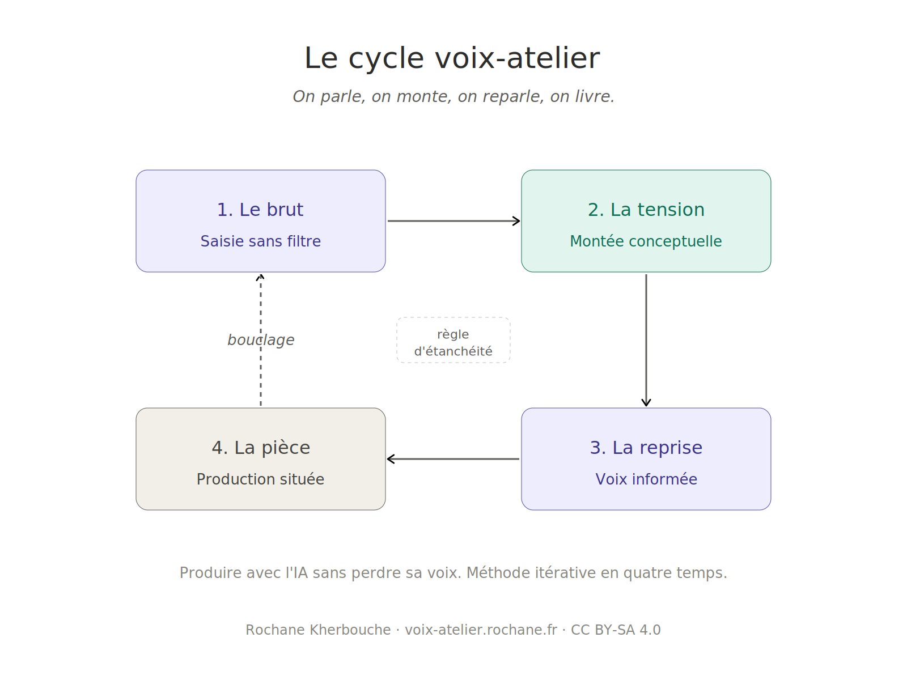

# The voix-atelier cycle

**A four-stage protocol for producing content with AI without losing your voice.**

---

## In three sentences

Most methods for writing better with AI focus on finding the right prompt. This repository proposes something different: a four-stage discipline that alternates raw human speech and analytical processing by AI, producing texts that carry an identifiable voice rather than the statistical average of the training corpus. The method can be practiced with or without a dedicated skill, on Claude or any other LLM.

---

## The four stages

**T1, the raw.** You start with your own voice. Five to ten minutes of free speech or typing, no plan, no rereading. What you want to say, your blocks, your digressions. This raw material captures what AI cannot produce on its own: the singularity of a biographical trajectory, a rhythm, unresolved tensions.

**T2, the tension.** The AI mobilizes thinkers, concepts, theoretical frameworks from different fields. It applies each framework fully without smoothing, surfaces unexpected convergences, fertile contradictions, original ideas. The analytical elevation protocol structures this phase.

**T3, the recovery.** You take back the voice, now fed by T2. This is not a scholarly synthesis. It is a voice that has passed through the analysis and emerged modified. What moved, what resists, what remains unclear. This stage is the pivot that protects human voice from analytical flattening.

**T4, the piece.** The AI assembles the three layers under constraints of format, audience, and style. It delivers a draft that then returns to the author's hand. If the result does not satisfy, another loop is run. The cycle is iterative.

---

## The watertightness rule

Each stage has its own grammar. Cross-contamination between stages is the main cause of cycle failure.

Speaking at T1 after reading ten authors contaminates the voice, which becomes citational. Analyzing before capturing intuition confiscates the gesture. Producing at T4 without passing through T3 flattens the piece. Letting AI write in place of the human at T1 or T3 substitutes a simulated voice for the real one.

Watertightness matters as much as sequence.

---

## Installation for Claude

The [`skill/`](skill/) folder contains a complete Claude skill. To install:

**Via claude.ai**: in account settings, capabilities section, upload the contents of the `skill/` folder.

**Via Claude Code**: extract `skill/` into `~/.claude/skills/voix-atelier/`.

---

## Use outside Claude

The [`prompts-hors-claude/`](prompts-hors-claude/) folder contains prompts adapted for ChatGPT, Gemini, Mistral and other LLMs. The method works with any model, provided the cycle framing is handled manually.

---

## Acknowledged lineage

- The **mode bourré** and **gesture-matter** configuration that feed stages 1 and 3 are inspired by the work of Benoît Raphaël and Thomas Mahier, published in the [Génération IA](https://generationia.flint.media/) newsletter (French).
- The **analytical elevation protocol** mobilized at stage 2 draws on established traditions: Gestalt, phenomenology, archaeology of knowledge, steelmanning.
- The **cyclical form** is distantly inspired by **David Kolb**'s experiential learning cycle (1984), without borrowing his vocabulary.
- The **iterative cycling**, the identification of stage 3 as the protective pivot of the gesture, the **watertightness rule**, and the pedagogical transposition are the author's own contribution.

---

## Documented use case

The cycle was used to produce a 1500-word article on active pedagogies. Six successive versions, two factual corrections handled during production, mobilization of a specific writing skill at T4. The full account of this case is available in [`docs/exemple-pedagogies-actives.md`](docs/exemple-pedagogies-actives.md) (French).

---

## Author

**Rochane Kherbouche**
Technopedagogist, Brussels
Independent AI consultant, Kherbouche
AI Ambassador, French government *Osez l'IA* program

Portfolio: [ia.rochane.fr](https://ia.rochane.fr)
Contact: via GitHub or the portfolio

---

## License

This work is released under the [Creative Commons Attribution-ShareAlike 4.0 International (CC BY-SA 4.0)](LICENSE) license.

You may share, adapt and build upon this material, including for commercial use, provided you credit the author and distribute your contributions under the same license.

---

## Languages

- 🇫🇷 [Français](README.md)
- 🇬🇧 [English (this page)](README.en.md)
- 🇸🇦 [العربية](README.ar.md)
